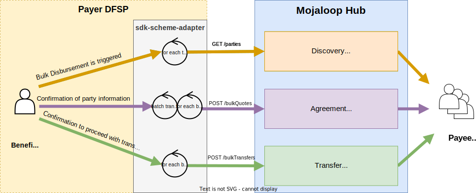

# SDK Support for Bulk Transfers - Overview
This design document describes how the SDK Scheme Adapter has been enhanced to support the bulk transfers use case.

## Why? - Mojaloop bulk transfer limitations overcome
The implementation of bulk transfers within Mojaloop have the following limitations that this SDK bulk enhancement is designed to overcome.
1. Only individual transfers that are addressed to the same Payer DFSP may be included in a bulk quotes and bulk transfers call.
1. The number of individual quotes and transfers in each bulkQuotes and bulkTransfers respectively are limited to a maximum of 1000.
1. In order to allow bulk functionality, all Payee DFSP's need to create integration support for bulk messaging. I.e. If the bulk use case were to be introduced into an existing scheme, then all connecting DFSPs would need to upgrade their connections and integrations into their core banking systems.
1. There is currently no bulk discovery call.

## SDK Scheme Adapter bulk enhancement requirements
The enhancements enable:
1. Transfers where the discovery has not yet been called.
1. No limit on number of transfers (limited by infrastructure, network capabilities but > 1k that ML FSPIOP specifies)
1. Payee integration support for bulk being optional
1. Optionally support 
   - a single call that performs Discovery, Agreement and Transfer
   - independently accepting of party lookups
   - independently accepting of quotes
   - setting a fee limit on the auto acceptance of quotes
   - the skipping of the discovery phase
   - running only the discovery phase
   - setting an expiration for the bulk message
   - home transaction IDs for both the bulk message and the individual transfers.
   - both synchronous API calls and asynchronous API calls

## Features Implemented
The current implementation does not include all the features. All the features that have been completed are functional and can be used. Additional features and enhancements can be added to the existing functionality as prioritized by Mojaloop product and the community. This aligns with the MVP (Minimal Viable Product) agile concept.
These are the features that are currently implemented:

|Feature|Implementation Status|Release Version|
|---|---|---|
|Asynchronous Mode| released | v14.1.0 RC|
|Synchronous Mode| not started | |
|Auto Accept Party| not started | |
|Auto Accept Quote (with fee limit)| not started | |
|Only Validate Party| not started | |
|Skip Party Lookup| not started | |
|Bulk Expiration| not started | |

### Functional Diagram

## Architectural Diagram
The Event Sourcing architecture has split the implementation into four components
1. **Backend API** : 
The backend API receives API call and produces corresponding domain events, and monitors domain events to produce API callbacks.
1. Domain Event Handler
The Domain Event Handler consumes Domain Events and produces Command events.
1. Command Event Handler
The Command Event Handler consumes command events and produces domain events
1. FSPIOP API
The FSPIOP API monitors domain events and produces corresponding FSPIOP calls, and monitors API Callbacks to produce corresponding domain events.

## Overview Sequence Diagram
Here is a sequence diagram that outlines the role that the SDK Scheme Adapter will play in a bulk call, both for a Payer DFSP and a Payee DFSP.

