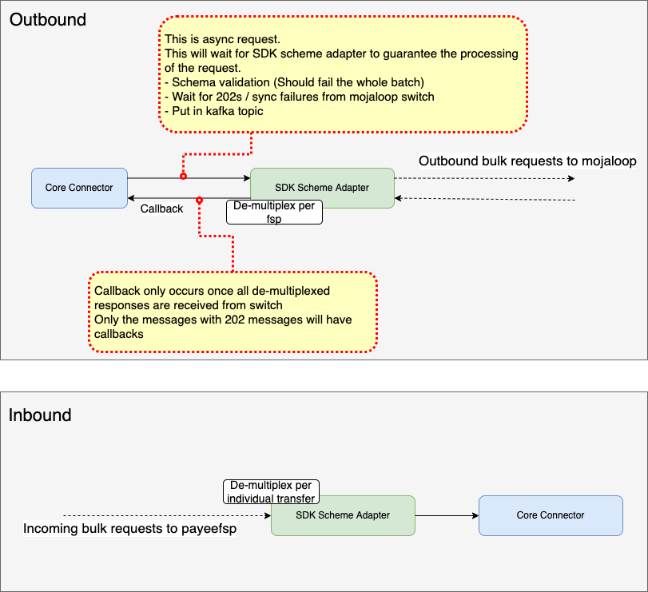
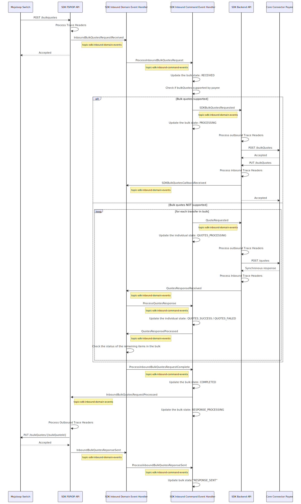
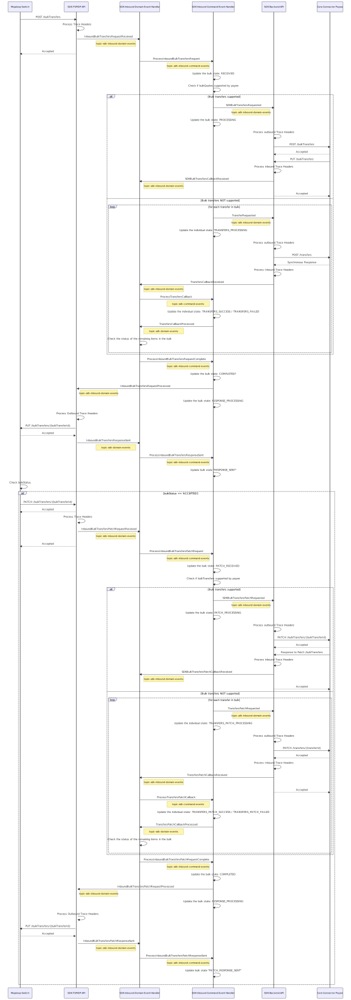

# Support for Bulk Transfers - DDD and Event Sourcing Design
## Design overview
This diagram summarizes the design role the SDK is performing.



An http 202 response when posting a asynchronous request means that the the SDK has accepted the request, and that the request will be processed and a response provided. Because of the potential long delay's involved in processing large numbers of bulk payments in an asynchronous way. A new design approach in the SDK was necessary to meet the 202 response expectations.

## DDD and Event sourcing design
An event sourcing and domain driven was chosen, as this solves all requirements of reliability and scalability while takeing advantage of the lib's and tools that have been built for the Mojaloop vNext architecture.

## Bulk Payer DFSP SDK-Scheme-Adapter
### Outbound event sourcing sequence diagram


## Payee DFSP SDK-Scheme-Adapter
### Inbound bulk quotes event sourcing sequence diagram


### Inbound bulk transfers event sourcing sequence diagram



## Redis Store Data mapping for outbound bulk transfer
### 1. States (Global and individual)

#### Command:
```
HSET <key> <attribute1> <value1>
```
#### Key:
```
outboundBulkTransaction_< bulkTransactionId >
```

#### Attributes:
- **bulkTransactionId**: bulkTransactionId
- **bulkHomeTransactionID**: Home transaction ID
- **request**: {
  options: Options,
  extensionList: Bulk Extension List
}
- **individualItem_< transactionId >**: Serialize ({
  id: transactionId
  request: {}
  state: Individual state
  batchId: `<UUID>`
  partyRequest: {}
  quotesRequest: {}
  transfersRequest: {}
  partyResponse: {}
  quotesResponse: {}
  transfersResponse: {}
  lastError: {}
  acceptParty: bool
  acceptQuotes: bool
})
- **state**: Global state
  - RECEIVED
  - DISCOVERY_PROCESSING
- **bulkBatch_< batchId >**: Serialize ({
  id: batchId
  state: Individual state
  - AGREEMENT_PROCESSING
  - TRANSFER_PROCESSING
  bulkQuoteId: `<UUID>`
  bulkTransferId: `<UUID>` (Can be batchId)
})
- **partyLookupTotalCount**: Total number of party lookup requests
- **partyLookupSuccessCount**: Total number of party lookup requests those are succeeded
- **partyLookupFailedCount**: Total number of party lookup requests those are failed
- **bulkQuotesTotalCount**: Total number of bulk quotes requests
- **bulkQuotesSuccessCount**: Total number of quotes requests those are succeeded
- **bulkQuotesFailedCount**: Total number of quotes requests those are failed
- **bulkTransfersTotalCount**: Total number of bulk transfers requests
- **bulkTransfersSuccessCount**: Total number of bulk transfers requests those are succeeded
- **bulkTransfersFailedCount**: Total number of bulk transfers requests those are failed

::: tip Notes
- Kafka messages should contain bulkID.
- To update the global state use the command `HSET bulkTransaction_< bulkTransactionId > state < stateValue >`
:::

### 2. For mapping individual callbacks with individual bulk items

#### Command:
```
HSET outboundBulkCorrelationMap <attribute1> <value1>
```

#### Attributes:
- partyLookup_`<id_type>`_`<id_value>`(_`<subid_type>`): "{ bulkTransactionId: `<bulkTransactionId>`, transactionId: `<transactionId>` }"
- bulkQuotes_`<bulkQuoteId>`: "{ bulkTransactionId: `<bulkTransactionId>`, batchId: `<batchId>` }"
- bulkTransfers_`<bulkTransferId>`: "{ bulkTransactionId: `<bulkTransactionId>`, batchId: `<batchId>`, bulkQuoteId: `<bulkQuoteId>` }"
- bulkHomeTransactionId_`<bulkHomeTransactionId>`: "{ bulkTransactionId: `<bulkTransactionId>` }"

::: tip Notes:
- We can use `HKEYS` command to fetch all the individual transfer IDs in a bulk to iterate
:::

## Redis message format for inbound bulk transfer
### 1. Bulk Quotes
#### Command:
```
HSET <key> <attribute1> <value1>
```
#### Key:
```
inboundBulkQuotes_< bulkQuotesId >
```

#### Attributes:
- **bulkQuotesId**: bulkQuotesId
- **individualItem_< quotesId >**: Serialize ({
  id: quotesId
  request: {}
  state: Individual state
  quotesRequest: {}
  quotesResponse: {}
  lastError: {}
})
- **state**: Global state
  - RECEIVED
  - PROCESSING
- **bulkQuotesTotalCount**: Total number of bulk quotes requests
- **bulkQuotesSuccessCount**: Total number of quotes requests those are succeeded
- **bulkQuotesFailedCount**: Total number of quotes requests those are failed

::: tip Notes
- Kafka messages should contain bulkQuotesId.
- To update the global state use the command `HSET bulkQuotes_< bulkQuotesId > state < stateValue >`
:::

### 2. Bulk Transfers
#### Command:
```
HSET <key> <attribute1> <value1>
```
#### Key:
```
inboundBulkTransfer_< bulkTransferId >
```

#### Attributes:
- **bulkTransferId**: bulkTransferId
- **individualItem_< transferId >**: Serialize ({
  id: transferId
  request: {}
  state: Individual state
  transfersRequest: {}
  transfersResponse: {}
  lastError: {}
})
- **state**: Global state
  - RECEIVED
  - PROCESSING
- **bulkTransferTotalCount**: Total number of bulk transfers requests
- **bulkTransferSuccessCount**: Total number of transfers requests those are succeeded
- **bulkTransferFailedCount**: Total number of transfers requests those are failed

::: tip Notes
- Kafka messages should contain bulkTransferId.
- To update the global state use the command `HSET bulkTransfer_< bulkTransferId > state < stateValue >`
:::

### 3. For mapping individual callbacks with individual bulk items

#### Command:
```
HSET inboundBulkCorrelationMap <attribute1> <value1>
```

#### Attributes:
- quotes_`<quoteId>`: "{ bulkQuoteId: `<bulkQuoteId>` }"
- transfers_`<transferId>`: "{ bulkTransferId: `<bulkTransferId>`, bulkQuoteId: `<bulkQuoteId>` }"

::: tip Notes:
- We can use `HKEYS` command to fetch all the individual transfer IDs in a bulk to iterate
:::
